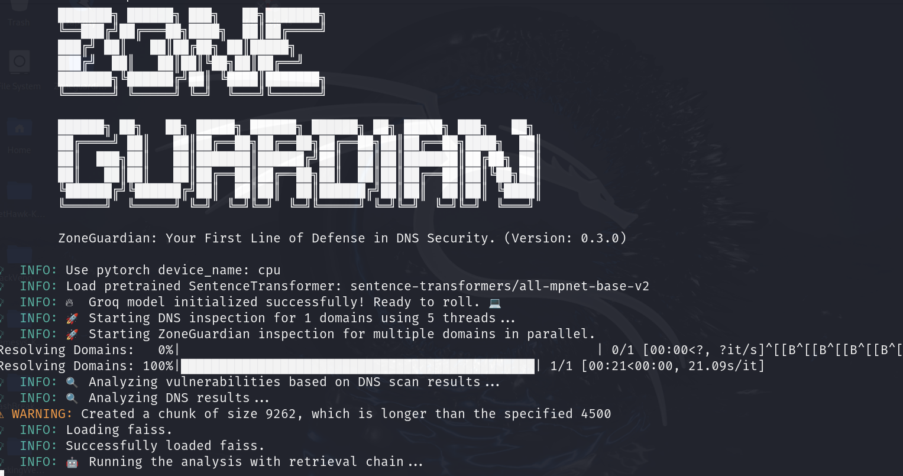
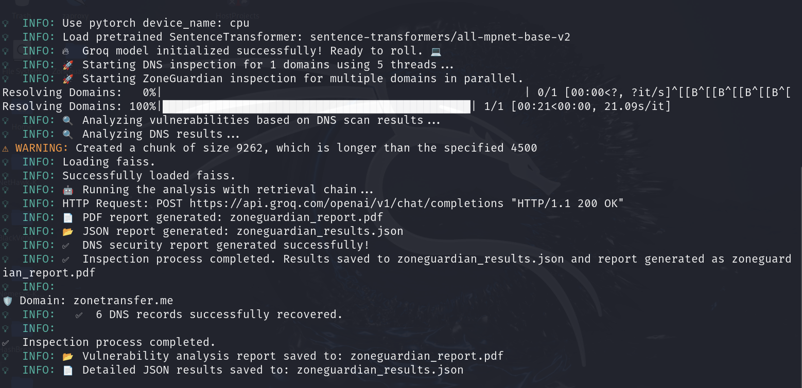

# 🌐 ZoneGuardian: DNS Vulnerability Analyzer 🚀

ZoneGuardian is a cutting-edge cybersecurity tool meticulously crafted to **inspect DNS configurations** and **identify potential vulnerabilities**. DNS, the backbone of internet infrastructure, is often a target for malicious attacks and misconfigurations that can compromise your organization's security. ZoneGuardian empowers you to proactively analyze, detect, and mitigate risks in your DNS setup with precision and ease.

With its advanced scanning capabilities, professional-grade reporting, and actionable insights, ZoneGuardian is an essential tool for IT administrators, cybersecurity professionals, and organizations aiming to fortify their digital assets. Whether you're safeguarding sensitive data or ensuring compliance, ZoneGuardian provides the tools you need to maintain a robust security posture.

**Secure your DNS. Protect your infrastructure. Trust ZoneGuardian.** 🚀

> ⚠️ **Disclaimer**: This tool has been developed **exclusively for educational and ethical hacking purposes**. It is designed to help users understand DNS security concepts and learn how to identify potential vulnerabilities in a controlled environment.  
>  
> **Unauthorized use of this tool on systems without explicit permission is strictly prohibited.** Always ensure you have the proper authorization before conducting any security analysis. The developer assumes no responsibility for misuse.

🙏 I would like to express my sincere gratitude to [Santiago Hernández, a leading expert in Cybersecurity and Artificial Intelligence](https://www.udemy.com/user/shramos/). His outstanding course on **Cybersecurity and Ethical Hacking**, available on Udemy, was instrumental in the development of this project. The insights and techniques I gained from his course were invaluable in guiding my approach to cybersecurity practices. Thank you for sharing your knowledge and expertise!

<p align="center">
  
  
  
</p>

<p align="center">
  
</p>

## 🌟 **Explore My Other Open-Source Ethical Hacking Tools**

If you're passionate about ethical hacking and want to elevate your cybersecurity toolkit, make sure to explore my suite of open-source projects. These tools are designed to empower penetration testers and cybersecurity professionals by streamlining complex tasks, enhancing security audits, and uncovering vulnerabilities with cutting-edge precision:

- [🦅 **NetHawk**](https://github.com/sergio11/nethawk_analyzer): A state-of-the-art **AI-powered ethical hacking tool** for **network vulnerability assessment**. Using advanced frameworks like **Scapy** and **Nmap**, NetHawk automates **port scanning**, **vulnerability detection**, and **report generation**, making security audits faster, smarter, and more efficient. Whether you're a **network administrator**, **cybersecurity expert**, or **ethical hacker**, NetHawk simplifies the assessment process and offers actionable insights to fortify your systems.
- [💀 **Nemesys**](https://github.com/sergio11/nemesys): An advanced **exploitation** and **post-exploitation** tool built on top of the **Metasploit Framework** for automating critical data harvesting and system enumeration.  
- [🕷️ **BlackVenom**](https://github.com/sergio11/blackvenom): The ultimate **ARP** and **DNS spoofing** tool for **intercepting network traffic** and uncovering vulnerabilities with stealth and precision.  
- [🌐 **ZeroTrace**](https://github.com/sergio11/zero_trace_hacking_tool): A powerful **search engine dorking** tool designed to identify **attack vectors** and uncover **exposed sensitive information** across the web.
- [🔐 **DecryptX**](https://github.com/sergio11/decryptx): An **advanced hash and password security assessment tool** that empowers you to analyze **password hashes**, **encrypted ZIP files**, and more. Ideal for evaluating the strength of encryption and identifying weaknesses in **security implementations**.
- [ 🌑 **EclipseRecon**](https://github.com/sergio11/eclipserecon): is a stealthy web reconnaissance tool for uncovering hidden vulnerabilities, subdomains, and site structures. 🕵️‍♂️🔍 It empowers security professionals to identify critical attack surfaces with precision, ensuring proactive defense. 🚨💻
- [ 🌐 **ZoneGuardian**](https://github.com/sergio11/zoneguardian): A powerful tool to analyze DNS configurations, detect vulnerabilities, and generate actionable security reports. 🔒🚀 Safeguard your digital assets with precision and ease!
- **Retrospect**: A cutting-edge **reconnaissance and security analysis tool** that retrieves and analyzes historical web snapshots, helping you uncover past vulnerabilities and misconfigurations before they can be exploited today. Ideal for **ethical hackers** and **digital forensics experts**.

These tools are designed to streamline penetration testing, enhance security assessments, and provide in-depth insights into vulnerabilities. Explore them to level up your ethical hacking skills! 💻🔍

## 🛠️ Features

- **DNS Record Analysis**: Thoroughly inspects DNS records for security risks and misconfigurations.  
- **WHOIS Integration**: Extracts and analyzes domain registration details to identify potential vulnerabilities.  
- **Actionable Security Reports**: Generates detailed and structured reports to prioritize vulnerabilities.  
- **Mitigation Recommendations**: Offers expert guidance to address and resolve identified risks.  
- **Professional Audit Output**: Creates ready-to-share reports in PDF format.

<p align="center">
  
</p>

## 🔍 Purpose

DNS misconfigurations and exposed zone data can reveal sensitive information about an organization’s infrastructure. ZoneGuardian aims to:  
1. **Protect** your infrastructure by identifying and mitigating vulnerabilities.  
2. **Simplify** the auditing process with structured insights and AI-powered analysis.  
3. **Empower** decision-makers with clear, professional reports and actionable steps.  


<p align="center">
  
</p>

## ⚙️ Tools & Technologies

ZoneGuardian is powered by state-of-the-art tools and frameworks, including:  

- **Core Libraries**: Python-based solutions for DNS record inspection, WHOIS data retrieval, and PDF report generation.  
- **AI Integration**: Advanced models and embeddings for intelligent data processing and analysis.  
- **Utility Frameworks**: Secure and efficient handling of environment variables, logging, and data structures.  

## 🏗️ How It Works

ZoneGuardian follows a systematic approach to DNS vulnerability analysis:  
1. Accepts domain names as input.  
2. Scans DNS records and retrieves WHOIS data for detailed insights.  
3. Identifies potential vulnerabilities and classifies them by severity:  
   - Critical vulnerabilities.  
   - Warnings.  
   - Informational notes.  
4. Provides tailored recommendations to address risks.  
5. Outputs a structured and professional report in PDF format.  

## 🌟 Why ZoneGuardian?

- **Proactive Security**: Stay ahead of attackers by uncovering vulnerabilities early.  
- **AI-Powered Insights**: Leverage intelligent analysis to prioritize actions.  
- **Clear & Professional Reports**: Enable informed decision-making with well-structured outputs.  
- **User-Friendly Design**: Simplifies complex security audits for efficient results.

# 🚀 Parameters and Options for ZoneGuardian Script

The ZoneGuardian script offers customizable parameters to tailor the DNS vulnerability analysis process. Below is a detailed guide:  

| **🔧 Parameter**    | **🛠️ Type**  | **📦 Default Value**        | **📋 Description**                                                                                         | **💡 Example Usage**                          |
|----------------------|-------------|-----------------------------|-------------------------------------------------------------------------------------------------------------|-----------------------------------------------|
| `--domains`          | `str`       | **Required**                | 🌐 A comma-separated list of domains to scan for vulnerabilities.                                           | `--domains example.com,example2.com`         |
| `--threads`          | `int`       | `10`                        | ⚡ Number of threads for parallel processing. Improves performance when scanning multiple domains.           | `--threads 20`                                |
| `--output-json`      | `str`       | `zoneguardian_results.json` | 📄 File path to save detailed DNS scan results in JSON format.                                              | `--output-json results/my_results.json`      |
| `--output-pdf`       | `str`       | `zoneguardian_report.pdf`   | 📊 File path to save the vulnerability analysis report in PDF format.                                       | `--output-pdf reports/my_report.pdf`         |


### 📋 Detailed Parameter Descriptions

1. **🌐 `--domains` (Required)**  
   Specifies the domains to be scanned.  
   - Example: `--domains example.com,example2.com`  
   - **Note**: Separate domains with commas, without spaces.

2. **⚡ `--threads`**  
   Sets the number of threads for parallel processing.  
   - Default: `10`  
   - A higher value speeds up the scan for multiple domains but may increase CPU usage.  
   - Example: `--threads 20`  

3. **📄 `--output-json`**  
   Defines the file path for saving detailed JSON results.  
   - Default: `zoneguardian_results.json`  
   - Includes all analyzed DNS records and WHOIS data.  
   - Example: `--output-json results/my_results.json`  

4. **📊 `--output-pdf`**  
   Defines the file path for saving the final PDF report.  
   - Default: `zoneguardian_report.pdf`  
   - Contains an executive summary, vulnerability classification, and recommendations.  
   - Example: `--output-pdf reports/my_report.pdf`  

### ✅ Usage Example

To scan two domains (`example.com` and `test.com`), using 15 threads, and save results in custom files:  

```bash
python zoneguardian.py --domains example.com,test.com --threads 15 --output-json results.json --output-pdf report.pdf
```

### 📌 Notes
Ensure all dependencies are installed before running the script.
* The --domains parameter is mandatory; the script will not execute without it.
* Customize the output paths to prevent overwriting existing files.

## ⚠️ Disclaimer  

**ZoneGuardian** was developed **exclusively for educational purposes** and as a **practical application of the knowledge acquired during my cybersecurity training**. Its primary objective is to **help security professionals and students understand DNS vulnerabilities** and **experiment within a controlled lab environment**.  

This tool is intended **only for ethical security research, authorized penetration testing, and learning purposes**. **Unauthorized scanning, probing, or exploitation of external DNS infrastructures without explicit permission** is **strictly prohibited** and may violate **cybersecurity laws**.  

All **testing and research conducted with ZoneGuardian were performed in an isolated cybersecurity lab environment** with **deliberately vulnerable systems** to ensure responsible and legal usage.  

The developer **disclaims any responsibility for misuse** of this tool. It is the user's sole responsibility to ensure that their activities are **fully compliant with legal and ethical guidelines** when using **ZoneGuardian**.  

## Acknowledgements 🙏

🙏 I would like to express my sincere gratitude to [Santiago Hernández, a leading expert in Cybersecurity and Artificial Intelligence](https://www.udemy.com/user/shramos/). His outstanding course on **Cybersecurity and Ethical Hacking**, available on Udemy, was instrumental in the development of this project. The insights and techniques I gained from his course were invaluable in guiding my approach to cybersecurity practices. Thank you for sharing your knowledge and expertise!


## 🤝 **Contributing**
Contributions to Zoneguardian are highly encouraged! If you're interested in adding new features, resolving bugs, or enhancing the project's functionality, please feel free to submit pull requests.

## Get in Touch 📬

Zoneguardian is developed and maintained by **Sergio Sánchez Sánchez** (Dream Software). Special thanks to the open-source community and the contributors who have made this project possible. If you have any questions, feedback, or suggestions, feel free to reach out at  [dreamsoftware92@gmail.com](mailto:dreamsoftware92@gmail.com).

## Visitors Count


 
 ## Please Share & Star the repository to keep me motivated.
  <a href = "https://github.com/sergio11/zoneguardian/stargazers">
     
  </a>

## License ⚖️

This project is licensed under the MIT License, an open-source software license that allows developers to freely use, copy, modify, and distribute the software. 🛠️ This includes use in both personal and commercial projects, with the only requirement being that the original copyright notice is retained. 📄

Please note the following limitations:

- The software is provided "as is", without any warranties, express or implied. 🚫🛡️
- If you distribute the software, whether in original or modified form, you must include the original copyright notice and license. 📑
- The license allows for commercial use, but you cannot claim ownership over the software itself. 🏷️

The goal of this license is to maximize freedom for developers while maintaining recognition for the original creators.

```
MIT License

Copyright (c) 2024 Dream software - Sergio Sánchez 

Permission is hereby granted, free of charge, to any person obtaining a copy
of this software and associated documentation files (the "Software"), to deal
in the Software without restriction, including without limitation the rights
to use, copy, modify, merge, publish, distribute, sublicense, and/or sell
copies of the Software, and to permit persons to whom the Software is
furnished to do so, subject to the following conditions:

The above copyright notice and this permission notice shall be included in all
copies or substantial portions of the Software.

THE SOFTWARE IS PROVIDED "AS IS", WITHOUT WARRANTY OF ANY KIND, EXPRESS OR
IMPLIED, INCLUDING BUT NOT LIMITED TO THE WARRANTIES OF MERCHANTABILITY,
FITNESS FOR A PARTICULAR PURPOSE AND NONINFRINGEMENT. IN NO EVENT SHALL THE
AUTHORS OR COPYRIGHT HOLDERS BE LIABLE FOR ANY CLAIM, DAMAGES OR OTHER
LIABILITY, WHETHER IN AN ACTION OF CONTRACT, TORT OR OTHERWISE, ARISING FROM,
OUT OF OR IN CONNECTION WITH THE SOFTWARE OR THE USE OR OTHER DEALINGS IN THE
SOFTWARE.
```
